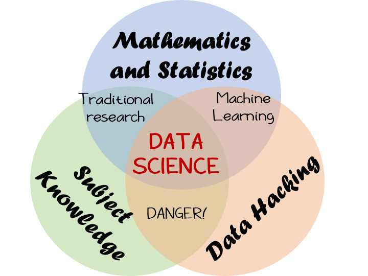
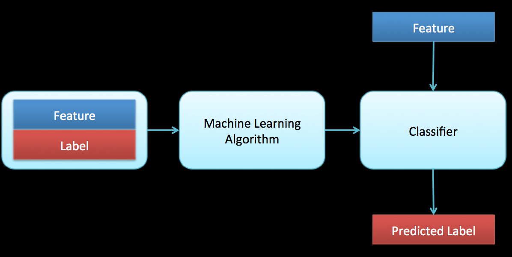

# Data Science @ the [Institute for Statistical Science](https://www.bristolmathsresearch.org/statistical-science/), [University of Bristol](bristol.ac.uk/)

[dsbristol.github.io](dsbristol.github.io) exists to host to the more applied Data Science activities in the Institute, especially:

### [The Data Science Toolbox Course Website](https://dsbristol.github.io/dst)

## Some Data Science Nuggets

* How is data science used in practice?

* How do we explore the performance

### Data Science links

* [Compass - EPSRC Centre for Doctoral Training in Computational Statistics and Data Science](http://www.bristol.ac.uk/cdt/compass/)
* [dsbristol.github.io](dsbristol.github.io), developed by
* [Daniel Lawson](http://www.maths.bristol.ac.uk/~madjl/) who is part of the
* [Institute for Statistical Science](https://www.bristolmathsresearch.org/statistical-science/).
* [Daniel Lawson's personal github page](https://danjlawson.github.io).

## Wider Data Science Activity at the University of Bristol

There are many Data Science Activities undertaken at the University of Bristol, which falls under the umbrella of the [Jean Golding Institute for Data Intensive Research](http://www.bristol.ac.uk/golding/).

The [Institute for Statistical Science](https://www.bristolmathsresearch.org/statistical-science/) is the Host for everything Statistical and Mathematical, with a focus on understanding Data Science methodology. There is a [Data Science Bristol](https://datascience.bris.ac.uk/) Blog run by the institute.

The [Intelligent Systems Lab](https://intelligentsystems.bristol.ac.uk/) is another core focus of activity, in the [Faculty of Engineering](http://www.bristol.ac.uk/engineering/).

### Contact:

Managed by [Daniel Lawson](http://www.maths.bristol.ac.uk/~madjl/).

